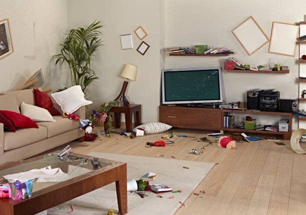
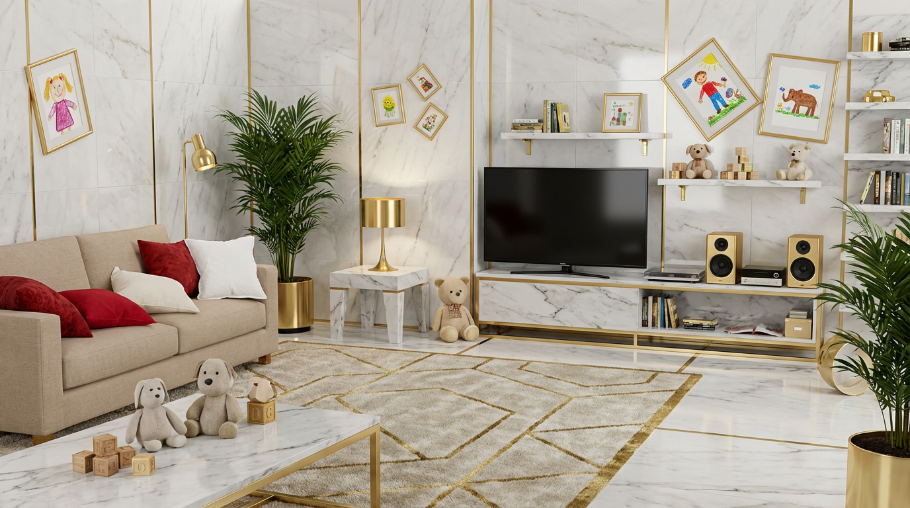

# InteryAI

### AI-Powered Interior Design

 

 
 

Transform any room with AI. Describe your dream space, upload a photo, or blend styles together.

**Professional interior design, democratized.**

 

---

 

| Before | After |
|:---:|:---:|
|  |  |

 

---

 

## Features

- **Text-to-Interior** — Describe your vision, AI generates photorealistic renders
- **Room Transform** — Upload a photo, preserve structure, change the style
- **Smart Detection** — AI identifies furniture with estimated prices
- **Multi-Turn Editing** — Refine designs through conversation

 

---

 

 
 

**Built with Google Gemini AI**

